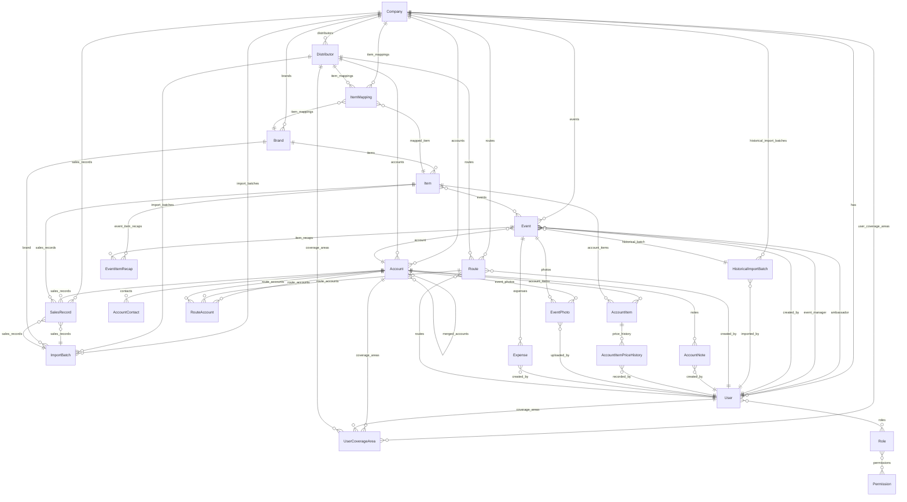

# Database Model Review

## Overview

23 models across 9 apps (core, accounts, catalog, distribution, events, event_import, imports, routes, sales). The reports app has no models of its own — it queries models from other apps. Total field count is approximately 200 (including auto-generated id, created_at, updated_at, and M2M intermediary columns). All apps follow a PostgreSQL-on-Django pattern with company-scoped multi-tenancy enforced via FK on most — but not all — models.

---

## Entity-Relationship Diagram

---

## Models by App

### apps/accounts

#### Account

A physical retail location (liquor store, restaurant, etc.) belonging to a Company, optionally serviced by a Distributor.

| Field | Type | Notes |
|---|---|---|
| id | AutoField | PK |
| company | FK → core.Company | PROTECT, related_name='accounts' |
| distributor | FK → distribution.Distributor | SET_NULL, null=True, blank=True, related_name='accounts' |
| merged_into | FK → self | SET_NULL, null=True, blank=True, related_name='merged_accounts' |
| merge_note | TextField | blank=True |
| name | CharField(255) | required |
| street | CharField(255) | blank=True |
| city | CharField(100) | blank=True |
| state | CharField(50) | blank=True |
| zip_code | CharField(20) | blank=True |
| phone | CharField(50) | blank=True |
| address_normalized | CharField(255) | blank=True |
| city_normalized | CharField(100) | blank=True |
| state_normalized | CharField(50) | blank=True |
| vip_outlet_id | CharField(100) | blank=True |
| county | CharField(100) | blank=True, default='Unknown' |
| on_off_premise | CharField(10) | blank=True, default='Unknown' |
| account_type | CharField(100) | blank=True, default='' |
| third_party_id | CharField(100) | blank=True, default='' |
| distributor_route | CharField(500) | blank=True, default='' |
| is_active | BooleanField | default=True |
| auto_created | BooleanField | default=False — flagged when created by import |
| created_at | DateTimeField | auto_now_add (via TimeStampedModel) |
| updated_at | DateTimeField | auto_now (via TimeStampedModel) |

**Relationships incoming:**
- UserCoverageArea.account (FK, SET_NULL)
- AccountItem.account (FK, CASCADE)
- AccountContact.account (FK, CASCADE)
- AccountNote.account (FK, CASCADE)
- EventPhoto.account (FK, SET_NULL)
- RouteAccount.account (FK, CASCADE)
- SalesRecord.account (FK, PROTECT)
- Event.account (FK, SET_NULL)

**Relationships outgoing:**
- → core.Company (FK, PROTECT)
- → distribution.Distributor (FK, SET_NULL)
- → self / merged_into (FK, SET_NULL)

**Notable:**
- Custom managers: `objects` (default, all records) and `active_accounts` (excludes `is_active=False` and `merged_into__isnull=False`)
- `ordering = ['company', 'name']`
- No `unique_together` — account uniqueness is enforced via normalized address matching in import logic, not at the DB level

---

#### AccountContact

A named contact person (owner, manager, employee) at an Account.

| Field | Type | Notes |
|---|---|---|
| id | AutoField | PK |
| account | FK → accounts.Account | CASCADE, related_name='contacts' |
| title | CharField(20) | choices: owner/manager/employee/other; default=other |
| name | CharField(200) | required |
| email | EmailField | blank=True, default='' |
| phone | CharField(30) | blank=True, default='' |
| note | TextField | blank=True, default='' |
| is_tasting_contact | BooleanField | default=False |
| created_at | DateTimeField | auto_now_add (manual, NOT via TimeStampedModel) |
| updated_at | DateTimeField | auto_now (manual, NOT via TimeStampedModel) |

**Relationships outgoing:**
- → accounts.Account (FK, CASCADE)

**Notable:**
- Does NOT inherit TimeStampedModel — timestamps defined manually
- No `company` FK — tenant scope is implicit through `account.company`
- `ordering = ['-is_tasting_contact', 'name']`

---

#### AccountItem

Junction record asserting that a specific catalog Item has been sold at an Account.

| Field | Type | Notes |
|---|---|---|
| id | AutoField | PK |
| account | FK → accounts.Account | CASCADE, related_name='account_items' |
| item | FK → catalog.Item | CASCADE, related_name='account_items' |
| date_first_associated | DateField | required; set on creation, never updated |
| current_price | DecimalField(6,2) | null=True, blank=True |

**Relationships incoming:**
- AccountItemPriceHistory.account_item (FK, CASCADE)

**Relationships outgoing:**
- → accounts.Account (FK, CASCADE)
- → catalog.Item (FK, CASCADE)

**Notable:**
- Does NOT inherit TimeStampedModel — no created_at/updated_at
- `unique_together = [['account', 'item']]`
- No `company` FK — tenant scope implicit via account
- `date_first_associated` is a required DateField, not auto-populated — must be set explicitly in application code

---

#### AccountItemPriceHistory

Append-only log of shelf prices captured for an AccountItem via event recap.

| Field | Type | Notes |
|---|---|---|
| id | AutoField | PK |
| account_item | FK → accounts.AccountItem | CASCADE, related_name='price_history' |
| price | DecimalField(6,2) | required |
| recorded_at | DateTimeField | auto_now_add |
| recorded_by | FK → core.User | SET_NULL, null=True, blank=True, related_name='price_history_entries' |

**Relationships outgoing:**
- → accounts.AccountItem (FK, CASCADE)
- → core.User (FK, SET_NULL)

**Notable:**
- Does NOT inherit TimeStampedModel (has `recorded_at` only, not `updated_at`)
- No `company` FK — tenant scope implicit via account_item→account

---

#### AccountNote

A free-text note attached to an Account, authored by a User.

| Field | Type | Notes |
|---|---|---|
| id | AutoField | PK |
| account | FK → accounts.Account | CASCADE, related_name='notes' |
| body | TextField | required |
| created_by | FK → core.User | SET_NULL, null=True, related_name='created_notes' |
| created_at | DateTimeField | auto_now_add (manual) |
| updated_at | DateTimeField | auto_now (manual) |

**Relationships outgoing:**
- → accounts.Account (FK, CASCADE)
- → core.User (FK, SET_NULL)

**Notable:**
- Does NOT inherit TimeStampedModel — timestamps defined manually
- No `company` FK — tenant scope implicit via account
- `ordering = ['-created_at']`

---

#### UserCoverageArea

Defines the geographic or organizational scope of a single user's field coverage.

| Field | Type | Notes |
|---|---|---|
| id | AutoField | PK |
| company | FK → core.Company | PROTECT, related_name='user_coverage_areas' |
| user | FK → core.User | PROTECT, related_name='coverage_areas' |
| coverage_type | CharField(20) | choices: distributor/county/city/account |
| distributor | FK → distribution.Distributor | PROTECT, related_name='coverage_areas' — **always required** |
| account | FK → accounts.Account | SET_NULL, null=True, blank=True, related_name='coverage_areas' |
| state | CharField(100) | blank=True |
| county | CharField(100) | blank=True |
| city | CharField(100) | blank=True |
| created_at | DateTimeField | auto_now_add (via TimeStampedModel) |
| updated_at | DateTimeField | auto_now (via TimeStampedModel) |

**Relationships outgoing:**
- → core.Company (FK, PROTECT)
- → core.User (FK, PROTECT)
- → distribution.Distributor (FK, PROTECT)
- → accounts.Account (FK, SET_NULL)

**Notable:**
- `ordering = ['company', 'user', 'coverage_type']`
- `distributor` is **required even for COUNTY, CITY, and ACCOUNT coverage types**, which is semantically odd

---

### apps/catalog

#### Brand

A product brand belonging to a Company (e.g. "Señor Sangria").

| Field | Type | Notes |
|---|---|---|
| id | AutoField | PK |
| company | FK → core.Company | PROTECT, related_name='brands' |
| name | CharField(255) | required |
| description | TextField | blank=True |
| is_active | BooleanField | default=True |
| created_at | DateTimeField | auto_now_add (via TimeStampedModel) |
| updated_at | DateTimeField | auto_now (via TimeStampedModel) |

**Relationships incoming:**
- Item.brand (FK, PROTECT)
- ImportBatch.brand (FK, PROTECT)
- ItemMapping.brand (FK, PROTECT)

**Relationships outgoing:**
- → core.Company (FK, PROTECT)

**Notable:**
- `unique_together = [['company', 'name']]`
- `ordering = ['company', 'name']`

---

#### Item

A specific SKU (Stock Keeping Unit) belonging to a Brand.

| Field | Type | Notes |
|---|---|---|
| id | AutoField | PK |
| brand | FK → catalog.Brand | PROTECT, related_name='items' |
| name | CharField(255) | required |
| item_code | CharField(100) | internal code (e.g. "Red0750"); unique within Brand |
| sku_number | CharField(100) | blank=True; external SKU, optional |
| description | TextField | blank=True |
| is_active | BooleanField | default=True |
| sort_order | PositiveIntegerField | default=0 |
| created_at | DateTimeField | auto_now_add (via TimeStampedModel) |
| updated_at | DateTimeField | auto_now (via TimeStampedModel) |

**Relationships incoming:**
- AccountItem.item (FK, CASCADE)
- EventItemRecap.item (FK, CASCADE)
- SalesRecord.item (FK, PROTECT)
- Event.items (M2M)
- ItemMapping.mapped_item (FK, SET_NULL)

**Relationships outgoing:**
- → catalog.Brand (FK, PROTECT)

**Notable:**
- `unique_together = [['brand', 'item_code']]`
- `ordering = ['brand', 'sort_order', 'name']`
- `company` property: `return self.brand.company` (convenience accessor, not a DB field)

---

### apps/core

#### Company

Top-level tenant. All company-scoped data is gated through this model.

| Field | Type | Notes |
|---|---|---|
| id | AutoField | PK |
| name | CharField(255) | required |
| slug | SlugField(120) | unique, auto-generated from name |
| is_active | BooleanField | default=True |
| created_at | DateTimeField | auto_now_add (via TimeStampedModel) |
| updated_at | DateTimeField | auto_now (via TimeStampedModel) |

**Notable:**
- `slug` auto-generated in `save()` if not provided
- `ordering = ['name']`

---

#### Permission

A single granular RBAC permission, e.g. `can_release_event`.

| Field | Type | Notes |
|---|---|---|
| id | AutoField | PK |
| codename | CharField(100) | unique |
| description | CharField(255) | human-readable label |

**Relationships incoming:**
- Role.permissions (M2M)

**Notable:**
- Global (not tenant-scoped) — intentional; permissions are system-wide definitions
- `ordering = ['codename']`
- Defined in `apps/core/rbac.py`, imported into `apps/core/models.py`

---

#### Role

A named bundle of permissions (e.g. "Supplier Admin").

| Field | Type | Notes |
|---|---|---|
| id | AutoField | PK |
| name | CharField(100) | unique |
| codename | CharField(100) | unique; slug for code use (e.g. 'supplier_admin') |
| permissions | M2M → core.Permission | blank=True, related_name='roles' |

**Relationships incoming:**
- User.roles (M2M)

**Notable:**
- Global (not tenant-scoped) — intentional
- `ordering = ['name']`
- Defined in `apps/core/rbac.py`

---

#### User

Extended user model (AbstractUser + TimeStampedModel). Central auth and RBAC subject.

| Field (notable) | Type | Notes |
|---|---|---|
| id | AutoField | PK |
| username | CharField | from AbstractUser |
| first_name, last_name | CharField | from AbstractUser |
| email | EmailField | from AbstractUser |
| company | FK → core.Company | PROTECT, null=True, blank=True (null for saas_admin) |
| roles | M2M → core.Role | blank=True, related_name='users' |
| phone | CharField(50) | blank=True |
| created_by | FK → self | SET_NULL, null=True, blank=True, related_name='created_users' |
| created_at | DateTimeField | auto_now_add (via TimeStampedModel) |
| updated_at | DateTimeField | auto_now (via TimeStampedModel) |

**Relationships incoming:**
- UserCoverageArea.user (FK, PROTECT)
- AccountNote.created_by (FK, SET_NULL)
- AccountItemPriceHistory.recorded_by (FK, SET_NULL)
- Event.ambassador (FK, SET_NULL)
- Event.event_manager (FK, SET_NULL)
- Event.created_by (FK, SET_NULL)
- EventPhoto.uploaded_by (FK, SET_NULL)
- Expense.created_by (FK, SET_NULL)
- Route.created_by (FK, CASCADE)
- HistoricalImportBatch.imported_by (FK, SET_NULL)

**Notable:**
- `company` is null for SaaS Admin (cross-tenant role)
- Role convenience properties: `is_saas_admin`, `is_supplier_admin`, `is_sales_manager`, `is_territory_manager`, `is_ambassador_manager`, `is_ambassador`, `is_distributor_contact`, `is_payroll_reviewer` — all delegate to `has_role(codename)`
- `has_permission(codename)` — checks across all roles' permissions; instance-cached
- `ordering = ['last_name', 'first_name']`

---

### apps/distribution

#### Distributor

A distribution company that services Accounts for a Company.

| Field | Type | Notes |
|---|---|---|
| id | AutoField | PK |
| company | FK → core.Company | PROTECT, related_name='distributors' |
| name | CharField(255) | required |
| address | CharField(500) | blank=True |
| city | CharField(100) | blank=True |
| state | CharField(50) | blank=True |
| notes | TextField | blank=True |
| is_active | BooleanField | default=True |
| created_at | DateTimeField | auto_now_add (via TimeStampedModel) |
| updated_at | DateTimeField | auto_now (via TimeStampedModel) |

**Relationships incoming:**
- Account.distributor (FK, SET_NULL)
- ImportBatch.distributor (FK, PROTECT)
- ItemMapping.distributor (FK, SET_NULL)
- UserCoverageArea.distributor (FK, PROTECT)
- Route.distributor (FK, CASCADE)

**Relationships outgoing:**
- → core.Company (FK, PROTECT)

**Notable:**
- `ordering = ['company', 'name']`
- No `unique_together` — two distributors with the same name under the same company is allowed

---

### apps/event_import

#### HistoricalImportBatch

Tracks a single historical event import run (Stage 3 of the historical event import tool).

| Field | Type | Notes |
|---|---|---|
| id | AutoField | PK |
| company | FK → core.Company | **CASCADE**, related_name='historical_import_batches' |
| imported_by | FK → core.User | SET_NULL, null=True, related_name='historical_import_batches' |
| imported_at | DateTimeField | auto_now_add |
| event_count | IntegerField | default=0; updated after all events are created |
| csv_filename | CharField(255) | blank=True |
| notes | TextField | blank=True |
| created_at | DateTimeField | auto_now_add (via TimeStampedModel) |
| updated_at | DateTimeField | auto_now (via TimeStampedModel) |

**Relationships incoming:**
- Event.historical_batch (FK, SET_NULL)

**Relationships outgoing:**
- → core.Company (**FK, CASCADE** — deviates from PROTECT used on other company FKs)
- → core.User (FK, SET_NULL)

**Notable:**
- `ordering = ['-imported_at']`
- `imported_at` and `created_at` are effectively duplicates (both auto_now_add); `imported_at` is the domain field, `created_at` is from TimeStampedModel

---

### apps/events

#### Event

A field activity: in-store tasting, special event, or admin hours.

| Field | Type | Notes |
|---|---|---|
| id | AutoField | PK |
| company | FK → core.Company | PROTECT, related_name='events' |
| event_type | CharField(20) | choices: tasting/special_event/admin; default=tasting |
| status | CharField(30) | 8 choices (Draft→…→Paid); default=draft |
| account | FK → accounts.Account | SET_NULL, null=True, blank=True, related_name='events' |
| date | DateField | null=True, blank=True |
| start_time | TimeField | null=True, blank=True |
| duration_hours | PositiveSmallIntegerField | default=0 |
| duration_minutes | PositiveSmallIntegerField | default=0; choices: 0/15/30/45 |
| ambassador | FK → core.User | SET_NULL, null=True, blank=True, related_name='ambassador_events' |
| event_manager | FK → core.User | SET_NULL, null=True, blank=True, related_name='managed_events' |
| created_by | FK → core.User | SET_NULL, null=True, blank=True, related_name='created_events' |
| items | M2M → catalog.Item | blank=True, related_name='events' |
| notes | TextField | blank=True |
| revision_note | TextField | blank=True |
| historical_batch | FK → event_import.HistoricalImportBatch | SET_NULL, null=True, blank=True, related_name='events' |
| is_imported | BooleanField | default=False |
| legacy_ambassador_name | CharField(255) | blank=True, default='' |
| recap_samples_poured | IntegerField | null=True, blank=True |
| recap_qr_codes_scanned | IntegerField | null=True, blank=True |
| recap_notes | TextField | blank=True |
| recap_comment | TextField | blank=True |
| created_at | DateTimeField | auto_now_add (via TimeStampedModel) |
| updated_at | DateTimeField | auto_now (via TimeStampedModel) |

**Relationships incoming:**
- EventPhoto.event (FK, CASCADE)
- EventItemRecap.event (FK, CASCADE)
- Expense.event (FK, CASCADE)

**Relationships outgoing:**
- → core.Company (FK, PROTECT)
- → accounts.Account (FK, SET_NULL)
- → core.User × 3 (ambassador, event_manager, created_by — all SET_NULL)
- → catalog.Item (M2M)
- → event_import.HistoricalImportBatch (FK, SET_NULL)

**Notable:**
- Properties: `duration_display`, `status_badge_class`
- No ordering defined in Meta — queries must specify order explicitly
- `Paid` status exists in choices but is not yet wired into the workflow UI
- `date` and `start_time` are nullable — scheduling is optional at creation

---

#### EventItemRecap

Per-item recap data captured during a Tasting event recap. One record per (event, item) pair.

| Field | Type | Notes |
|---|---|---|
| id | AutoField | PK |
| event | FK → events.Event | CASCADE, related_name='item_recaps' |
| item | FK → catalog.Item | **CASCADE**, related_name='event_item_recaps' |
| shelf_price | DecimalField(6,2) | null=True, blank=True |
| bottles_sold | IntegerField | null=True, blank=True |
| bottles_used_for_samples | IntegerField | null=True, blank=True |

**Relationships outgoing:**
- → events.Event (FK, CASCADE)
- → catalog.Item (FK, **CASCADE** — see Issues section)

**Notable:**
- `unique_together = [['event', 'item']]`
- **No timestamps at all** — no created_at, no updated_at
- No `company` FK — tenant scope implicit via event

---

#### EventPhoto

Photo uploaded during event recap, associated to both Event and Account.

| Field | Type | Notes |
|---|---|---|
| id | AutoField | PK |
| event | FK → events.Event | CASCADE, related_name='photos' |
| account | FK → accounts.Account | SET_NULL, null=True, blank=True, related_name='event_photos' |
| file_url | CharField(500) | stores local path or object storage URL |
| uploaded_at | DateTimeField | auto_now_add |
| uploaded_by | FK → core.User | SET_NULL, null=True, blank=True, related_name='uploaded_event_photos' |

**Relationships outgoing:**
- → events.Event (FK, CASCADE)
- → accounts.Account (FK, SET_NULL)
- → core.User (FK, SET_NULL)

**Notable:**
- `file_url` is CharField not FileField — intentional per PRODUCT_DECISIONS.md to abstract storage backend
- Does NOT inherit TimeStampedModel — only `uploaded_at`, no `updated_at`
- No `company` FK

---

#### Expense

A single expense (with receipt) associated with an event recap.

| Field | Type | Notes |
|---|---|---|
| id | AutoField | PK |
| event | FK → events.Event | CASCADE, related_name='expenses' |
| amount | DecimalField(8,2) | required |
| description | CharField(200) | required |
| receipt_photo_url | CharField(500) | required |
| created_at | DateTimeField | auto_now_add |
| created_by | FK → core.User | SET_NULL, null=True, blank=True, related_name='created_expenses' |

**Relationships outgoing:**
- → events.Event (FK, CASCADE)
- → core.User (FK, SET_NULL)

**Notable:**
- Does NOT inherit TimeStampedModel — has `created_at` only, no `updated_at`
- No `company` FK
- `ordering = ['created_at']`

---

### apps/imports

#### ImportBatch

Tracks a single file import from a distributor (sales data or inventory data).

| Field | Type | Notes |
|---|---|---|
| id | AutoField | PK |
| company | FK → core.Company | PROTECT, related_name='import_batches' |
| brand | FK → catalog.Brand | PROTECT, null=True, blank=True, related_name='import_batches' |
| distributor | FK → distribution.Distributor | PROTECT, related_name='import_batches' |
| import_type | CharField(20) | choices: sales_data/inventory_data; default=sales_data |
| import_date | DateField | auto_now_add |
| status | CharField(20) | choices: pending/complete/has_unmapped_items/failed |
| filename | CharField(500) | JSON array of filenames or legacy plain string |
| notes | TextField | blank=True |
| date_range_start | DateField | null=True, blank=True |
| date_range_end | DateField | null=True, blank=True |
| records_imported | IntegerField | default=0 |
| accounts_created | IntegerField | default=0 |
| accounts_reactivated | IntegerField | default=0 |
| records_skipped | IntegerField | default=0 |
| account_items_created | IntegerField | default=0 |
| created_at | DateTimeField | auto_now_add (via TimeStampedModel) |
| updated_at | DateTimeField | auto_now (via TimeStampedModel) |

**Relationships incoming:**
- SalesRecord.import_batch (FK, CASCADE)

**Relationships outgoing:**
- → core.Company (FK, PROTECT)
- → catalog.Brand (FK, PROTECT, nullable)
- → distribution.Distributor (FK, PROTECT)

**Notable:**
- `import_date` and `created_at` are both auto_now_add — duplicate timestamps
- `filename` stores JSON-encoded list or legacy plain string; `.filename_display` property formats it
- `ordering = ['-import_date', '-created_at']`
- `inventory_data` import_type exists in choices but appears unused (no inventory import flow in current codebase)

---

#### ItemMapping

Maps a raw item code from an import file to a catalog Item.

| Field | Type | Notes |
|---|---|---|
| id | AutoField | PK |
| company | FK → core.Company | PROTECT, related_name='item_mappings' |
| distributor | FK → distribution.Distributor | **SET_NULL**, null=True, blank=True, related_name='item_mappings' |
| brand | FK → catalog.Brand | PROTECT, null=True, blank=True, related_name='item_mappings' |
| raw_item_name | CharField(500) | the item code exactly as it appeared in the import file |
| mapped_item | FK → catalog.Item | SET_NULL, null=True, blank=True, related_name='item_mappings' |
| status | CharField(20) | choices: unmapped/mapped/ignored; default=unmapped |
| created_at | DateTimeField | auto_now_add (via TimeStampedModel) |
| updated_at | DateTimeField | auto_now (via TimeStampedModel) |

**Relationships outgoing:**
- → core.Company (FK, PROTECT)
- → distribution.Distributor (FK, **SET_NULL** — see Issues section)
- → catalog.Brand (FK, PROTECT, nullable)
- → catalog.Item (FK, SET_NULL, nullable)

**Notable:**
- `unique_together = [['company', 'distributor', 'raw_item_name']]`
- `ordering = ['status', 'distributor', 'raw_item_name']`
- If distributor is deleted (SET_NULL), the unique constraint on `(company, null, raw_item_name)` changes behavior — see Issues section

---

### apps/routes

#### Route

A named ordered list of Accounts created by a User for planning purposes.

| Field | Type | Notes |
|---|---|---|
| id | AutoField | PK |
| company | FK → core.Company | **CASCADE**, related_name='routes' |
| distributor | FK → distribution.Distributor | **CASCADE**, related_name='routes' |
| created_by | FK → core.User | **CASCADE**, related_name='routes' |
| name | CharField(100) | required |
| created_at | DateTimeField | auto_now_add (via TimeStampedModel) |
| updated_at | DateTimeField | auto_now (via TimeStampedModel) |

**Relationships incoming:**
- RouteAccount.route (FK, CASCADE)

**Relationships outgoing:**
- → core.Company (FK, **CASCADE**)
- → distribution.Distributor (FK, **CASCADE**)
- → core.User (FK, **CASCADE**)

**Notable:**
- `unique_together = [['created_by', 'distributor', 'name']]`
- Routes are private to their creator — only `created_by` can see/modify
- Three CASCADE FKs: all of company/distributor/user deletion silently deletes routes

---

#### RouteAccount

Membership record linking an Account to a Route, with position ordering.

| Field | Type | Notes |
|---|---|---|
| id | AutoField | PK |
| route | FK → routes.Route | CASCADE, related_name='route_accounts' |
| account | FK → accounts.Account | CASCADE, related_name='route_accounts' |
| position | PositiveIntegerField | default=0 |

**Relationships outgoing:**
- → routes.Route (FK, CASCADE)
- → accounts.Account (FK, CASCADE)

**Notable:**
- `unique_together = [['route', 'account']]`
- `ordering = ['position', 'id']`
- Does NOT inherit TimeStampedModel — no timestamps at all
- No `company` FK — tenant scope implicit via route

---

### apps/sales

#### SalesRecord

One line of distributor sales data: what quantity of an Item was purchased by an Account on a given date.

| Field | Type | Notes |
|---|---|---|
| id | AutoField | PK |
| company | FK → core.Company | PROTECT, related_name='sales_records' |
| import_batch | FK → imports.ImportBatch | CASCADE, related_name='sales_records' |
| account | FK → accounts.Account | PROTECT, related_name='sales_records' |
| item | FK → catalog.Item | PROTECT, related_name='sales_records' |
| sale_date | DateField | required |
| quantity | IntegerField | may be negative (returns/corrections) |
| distributor_wholesale_price | DecimalField(10,2) | null=True, blank=True |
| created_at | DateTimeField | auto_now_add (via TimeStampedModel) |
| updated_at | DateTimeField | auto_now (via TimeStampedModel) |

**Relationships outgoing:**
- → core.Company (FK, PROTECT)
- → imports.ImportBatch (FK, CASCADE)
- → accounts.Account (FK, PROTECT)
- → catalog.Item (FK, PROTECT)

**Notable:**
- `ordering = ['-sale_date']`
- Three explicit composite indexes: `(company, sale_date)`, `(account, sale_date)`, `(item, sale_date)`
- Only model in the codebase with explicit `Meta.indexes` defined

---

## Cross-Cutting Patterns

**TimeStampedModel inheritance:** 13 of 23 models inherit TimeStampedModel (Company, User, Account, UserCoverageArea, Brand, Item, Distributor, Event, HistoricalImportBatch, ImportBatch, ItemMapping, Route, SalesRecord). The remaining 10 either have no timestamps (AccountItem, EventItemRecap, RouteAccount), have `created_at` only (EventPhoto, Expense), or define timestamps manually (AccountContact, AccountNote) — an inconsistent pattern.

**`company` FK presence:** 11 of 23 models have a direct `company` FK. The other 12 either rely on implicit scoping through parent FKs (AccountItem, AccountContact, AccountNote, AccountItemPriceHistory, EventPhoto, EventItemRecap, Expense, RouteAccount) or are intentionally global (Permission, Role). This creates implicit tenant dependencies that are only safe if all queries always join through a company-scoped parent.

**Soft-delete:** No model uses soft-delete (`deleted_at`, `is_deleted`). Account has `is_active` and `merged_into` for merge/deactivation, but full deletion is hard-delete throughout. No recovery mechanism exists.

**Naming patterns:** Most models follow `UpperCamelCase` with related_names in `snake_case_plural`. The `active_accounts` manager on Account is the only custom manager in the codebase.

---

## Opinionated Review — Issues and Smells

### Naming inconsistencies

1. **Duplicate auto-timestamps on ImportBatch.** `import_date` (DateField, auto_now_add) and `created_at` (DateTimeField, auto_now_add via TimeStampedModel) both record the same moment with different granularity. One should be removed — `import_date` is the domain field and could be a regular DateField set manually if a different import date needs to be recorded. **Recommendation:** Drop `import_date`, use `created_at.date()` where needed.

2. **Duplicate auto-timestamps on HistoricalImportBatch.** Same problem: `imported_at` (DateTimeField, auto_now_add) and `created_at` (TimeStampedModel). **Recommendation:** Drop `imported_at`, use `created_at` directly.

3. **`AccountNote` and `AccountContact` define timestamps manually** instead of inheriting TimeStampedModel. The fields are identical (`created_at`, `updated_at`), but they're not picked up in any generic query that filters by `TimeStampedModel` subclasses. **Recommendation:** Inherit TimeStampedModel.

4. **`Distributor` has no `unique_together(company, name)`** but `Brand` does. Two distributors with the same name under the same company are allowed by the DB. **Recommendation:** Add `unique_together = [['company', 'name']]` to Distributor.

5. **`Event` has no `Meta.ordering`.** Every list query must specify order explicitly; omitting it returns an undefined order. All other models with list views define ordering. **Recommendation:** Add `ordering = ['-date', '-created_at']`.

6. **`UserCoverageArea.user` FK uses PROTECT** while `AccountNote.created_by` uses SET_NULL. Both are "a user created/owns this record" semantics. The PROTECT on coverage areas means you must manually remove all coverage areas before deleting a user, while notes silently survive with a null author. **Recommendation:** Decide on one pattern and apply consistently.

---

### FK on_delete choices

7. **`EventItemRecap.item → CASCADE` is dangerous.** Deleting a catalog Item cascades to all recap records for that item across all events — silently destroying historical field data. This will likely surprise future users when they try to deactivate or replace an item. **Recommendation:** Change to PROTECT.

8. **`ItemMapping.distributor → SET_NULL` breaks the unique constraint.** `unique_together = [['company', 'distributor', 'raw_item_name']]`. If distributor is deleted and becomes NULL, a new mapping for `(company, None, raw_item_name)` would conflict with any other deleted-distributor mapping for the same raw_item_name. PostgreSQL treats NULLs as distinct in unique constraints, so in practice two NULL rows won't conflict — but the mapping becomes unresolvable and orphaned with no way to know which distributor it belonged to. **Recommendation:** Change to PROTECT to prevent accidental distributor deletion when mappings exist.

9. **`Route.created_by → CASCADE` silently destroys user-saved data.** Deleting a user account removes all their routes with no warning. Routes are curated planning data — the right behavior is probably to reassign or preserve them. **Recommendation:** Change to SET_NULL (requires `null=True` on the field) or use PROTECT to force explicit cleanup.

10. **`Route.distributor → CASCADE` silently destroys routes.** Deleting a distributor silently removes all routes for that distributor across all users. **Recommendation:** Change to PROTECT or SET_NULL.

11. **`HistoricalImportBatch.company → CASCADE` vs `ImportBatch.company → PROTECT`.** The two batch models are functionally parallel but use different on_delete behavior. For `HistoricalImportBatch`, cascading a company delete to historical import records (which then SET_NULL the Events' FK) is probably fine, but it's inconsistent and surprising. **Recommendation:** Document the intentional difference or align with PROTECT for consistency.

---

### Nullable / blank inconsistencies

12. **`AccountItem.date_first_associated` is a required DateField** (no null=True, no default) that must be set explicitly in application code. If the import code has a bug and doesn't set it, the save will fail with a DB-level IntegrityError rather than a clear application error. **Recommendation:** Add `default=datetime.date.today` or make application-level validation explicit.

13. **`UserCoverageArea.distributor` is always required** regardless of `coverage_type`. When `coverage_type=ACCOUNT`, the city/county/state fields are irrelevant, and when `coverage_type=COUNTY`, the account FK is irrelevant — but `distributor` is always required. This makes it impossible to create a company-wide coverage area that isn't distributor-scoped. **Recommendation:** Make `distributor` nullable with null=True, blank=True and validate via clean() instead.

14. **`SalesRecord.distributor_wholesale_price` is nullable** with no rationale in code comments or PRODUCT_DECISIONS.md. If it's always present in imports, it shouldn't be nullable. If it's sometimes missing, that context is worth documenting. **Recommendation:** Add a help_text explaining when this is null.

---

### Stub models / unused fields

15. **`ImportBatch.import_type` has an `inventory_data` choice that appears unused.** The import workflow only handles sales data. `inventory_data` exists in the TextChoices but no view creates a batch with that type. **Recommendation:** Remove the `inventory_data` choice or document when it will be used.

16. **`Event.Paid` status exists in choices but is not wired.** Per PRODUCT_DECISIONS.md: "Paid is the final status; added for future use — not yet wired into the event management workflow UI." Historical imports create events directly at `status='paid'` but there's no transition to reach Paid through normal workflow. `status_badge_class` doesn't even include a case for Paid (falls through to 'secondary'). **Recommendation:** Either wire it or remove it and add it back when the payroll workflow is built.

17. **`Event.recap_comment` (TextField) vs `Event.recap_notes` (TextField).** Both are free-text recap fields. Per the model comment, `recap_comment` is "Festival" and `recap_notes` is "Tasting Part 1". The naming suggests they serve different event types, but a future reader could easily confuse them. **Recommendation:** Rename to `recap_comment_festival` and `recap_notes_tasting` for clarity.

18. **`AccountContact` exists for a "Pending" phase.** Per PRODUCT_DECISIONS.md Phase Plan, "Phase 5 | CRM — Accounts (contacts, notes) | ⬜ Pending", yet the `AccountContact` model is fully built with views and templates. The `AccountNote` model is also built. These are ahead of their declared phase. This isn't a bug, but it means the model has been live in production without full phase documentation. **Recommendation:** Update PRODUCT_DECISIONS.md to reflect what's actually complete.

---

### Overlapping concepts

19. **`ImportBatch` and `HistoricalImportBatch` are parallel batch-tracking models** in different apps with overlapping purpose (both track import runs with a company FK, an author, timestamps, a count, filename storage, and notes). If a future phase adds more import types, this will fork further. **Recommendation:** Consolidate into a single `ImportBatch` with an `import_type` field that includes `historical_events`, or at minimum extract a shared abstract base.

---

### Multi-tenancy gaps

20. **`AccountItem`, `AccountContact`, `AccountNote`, `AccountItemPriceHistory`, `EventItemRecap`, `EventPhoto`, `Expense`, `RouteAccount` lack a `company` FK.** All 8 reach their tenant scope implicitly through parent model chains. In practice, all queries go through company-scoped parents, so cross-tenant leakage is low risk today. The risk is that any future direct query on these models (e.g., a management command, a new report, a Django admin action) that doesn't join through the parent chain could expose cross-tenant data. **Recommendation:** Add `company` FK to any of these that grow their own querysets in views — at minimum `EventItemRecap` and `AccountItem` which are directly used in reports.

21. **`Route.unique_together` does not include `company`.** The constraint is `(created_by, distributor, name)`. Since distributors are company-scoped, the implicit tenant scope is correct — but the constraint reads as if routes are user+distributor+name scoped, not company scoped. Any future code that looks at this constraint alone might misread the scope. **Recommendation:** Document the implicit company scope in a comment, or add company to the unique_together for explicitness.

---

### Index gaps

22. **`Account.company` has no explicit db_index.** Django auto-indexes FKs, so this is fine for single-field lookups. But the most common query pattern — `Account.objects.filter(company=..., is_active=True)` — would benefit from a composite index on `(company, is_active)`. With large account tables this could matter. **Recommendation:** Add `Meta.indexes = [Index(fields=['company', 'is_active'])]`.

23. **`Event` has no indexes beyond the FK auto-indexes.** The most common list query is `Event.objects.filter(company=..., status__in=..., date__gte=...)`. The `company+status+date` combination isn't covered by any single index. **Recommendation:** Add `Index(fields=['company', 'status', 'date'])`.

24. **`AccountItem.item` FK (CASCADE)** — Django auto-indexes this, but queries that pivot by item across accounts (e.g., "all accounts that buy item X") are common in report logic. The auto-index should suffice, but confirm with `EXPLAIN ANALYZE` on the report queries.

---

### App boundaries

25. **`AccountContact` and `AccountNote` are in `apps/accounts`** — correct. But `UserCoverageArea` is also in `apps/accounts` even though it's fundamentally about User scope (it references User, Distributor, and Account). It could reasonably live in `apps/core` since it's about user assignment, not account data. Minor — current location is defensible — but worth noting.

26. **`SalesRecord` is in `apps/sales`** but it's created exclusively by the import pipeline in `apps/imports`. The import pipeline directly writes `SalesRecord` objects. This is a clean app-boundary design: imports creates records, sales defines them. No issue.

---

### Anything else

27. **`Event` has no composite unique constraint on `(company, account, date, ambassador)` or similar.** Two events can be scheduled for the same account, date, time, and ambassador with no DB-level guard. Duplicate event creation is prevented only by application logic (if at all). **Recommendation:** Consider a partial unique constraint or at minimum an application-level validation.

28. **`ImportBatch.brand` is nullable** (PROTECT). The import flow for sales data is distributor-scoped, not brand-scoped at the batch level (brand is determined per-row via item mapping). The nullable brand FK on ImportBatch appears to be an early design decision that was superseded by the item mapping approach. It's now an orphaned design concept. **Recommendation:** Evaluate whether any query uses `ImportBatch.brand`; if not, consider removing the FK.

29. **`AccountItemPriceHistory` has no index on `account_item, recorded_at`** beyond the auto-indexed FK. If price history grows large (many events per account-item over years), the `ordering = ['account_item', '-recorded_at']` default sort would benefit from a composite index. **Recommendation:** Add `Index(fields=['account_item', '-recorded_at'])` if price history tables grow past ~100K rows.

30. **Three User FKs on Event** (`ambassador`, `event_manager`, `created_by`) all use SET_NULL with no cascade. This is correct, but it means event history is preserved even after users are deactivated or deleted — which is the right call, worth noting as intentional.

---

## Suggested Cleanup Priority

1. **`EventItemRecap.item → CASCADE` (Issue 7).** A supplier admin deleting an old item from the catalog would silently destroy historical recap data across all events. Change to PROTECT. **Effort: small** (one field, one migration).

2. **`ItemMapping.distributor → SET_NULL` + unique_together interaction (Issue 8).** If a distributor is ever deleted, mappings become orphaned with ambiguous identity. Change to PROTECT to block distributor deletion when mappings exist. **Effort: small** (one field, one migration).

3. **`Route.created_by → CASCADE` destroys user data on user deletion (Issue 9).** Change to SET_NULL with a null=True; add migration. Consider who "owns" the routes of a deleted user (probably reassign to their manager or the company's Supplier Admin). **Effort: small** (migration + possible reassignment logic).

4. **Duplicate timestamps on `ImportBatch` and `HistoricalImportBatch` (Issues 1 & 2).** `import_date` and `imported_at` are exact duplicates of `created_at`. Remove the domain-specific timestamp fields and use `created_at` throughout. **Effort: small** (two migrations, update any code referencing `import_date` / `imported_at`).

5. **`UserCoverageArea.distributor` always required regardless of coverage_type (Issue 13).** Add `null=True, blank=True` and enforce via `clean()` or view validation. This unlocks future coverage types that aren't distributor-scoped. **Effort: medium** (migration + coverage area query review).

6. **Add composite indexes on `Account` and `Event` (Issues 22 & 23).** `(company, is_active)` on Account and `(company, status, date)` on Event would materially speed up the most common list queries under load. **Effort: small** (two migrations, no code changes).

7. **`Distributor` missing `unique_together(company, name)` (Issue 4).** Prevents duplicate distributor names within a tenant. Low risk now (few distributors per company), but adds data integrity you'd want before a self-service onboarding flow. **Effort: small** (one migration; must ensure no existing duplicates first).

8. **Reconcile `AccountContact` / `AccountNote` with the "Phase 5 Pending" status in PRODUCT_DECISIONS.md (Issue 18).** The models and views exist; the phase plan doesn't reflect that. Update docs. **Effort: small** (documentation only).

---

## Models You Did NOT Find

- **`MasterAccount`** — PRODUCT_DECISIONS.md (lines 89–99) mentions a "MasterAccount model is stubbed in as the canonical record" for account deduplication. Migration history (`0001_initial.py` and `0005_remove_masteraccount.py` in `apps/distribution`) confirms it was created and then removed. The PRODUCT_DECISIONS.md entry at line 97 is now stale and refers to a model that no longer exists. **Clarify:** Should the MasterAccount concept documentation be updated to reflect the `merged_into` FK approach that replaced it?

- **`AccountCoverage` / `Territory`** — PRODUCT_DECISIONS.md mentions territory-based assignment in several places. These concepts exist only as coverage_type choices on `UserCoverageArea`, not as separate models. No clarification needed — just confirming the implementation matches.

- **Tasting Agencies** — PRODUCT_DECISIONS.md describes a future "Tasting Agency" entity (lines 275–283) that would be a separate Company/tenant type. No model exists for this. Explicitly deferred — no action needed.

- **`ImportBatch.import_type = 'inventory_data'`** — The `inventory_data` choice exists in code but there is no inventory import workflow, no views, and no PRODUCT_DECISIONS.md entry describing when this will be built. **Clarify:** Is this a planned feature with a spec, or a leftover from an early design that was abandoned? If abandoned, remove the choice.
